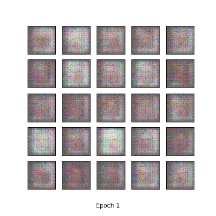

# Pytorch LFW GAN-DCGAN

## Introduction
Pytorch implementation of Generative Adversarial Networks (GAN) and Deep Convolutional Generative Adversarial Networks (DCGAN) for Labeled Faces in the Wild(LFW) face dataset.

* you can download
  - LFW dataset: http://vis-www.cs.umass.edu/lfw/

## Resutls
### LFW
* Generated images

<table align='center'>
<tr align='center'>
<td> GAN</td>
<td> DCGAN</td>
</tr>
<tr>
<td>
<td>
</tr>
</table>

* Training Loss

**Generator's Loss** :     

**Discriminator's Loss** : 

## Requirements

 - Python (2.7 or 3.5)
 - Pytorch 0.30
 - Matplotlib
 - Imageio

